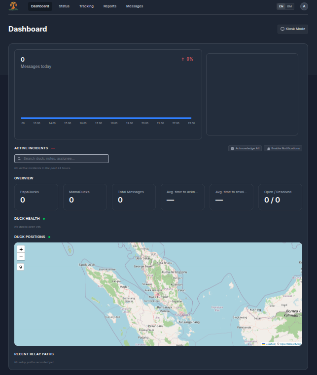
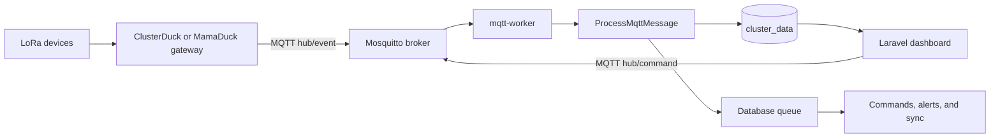
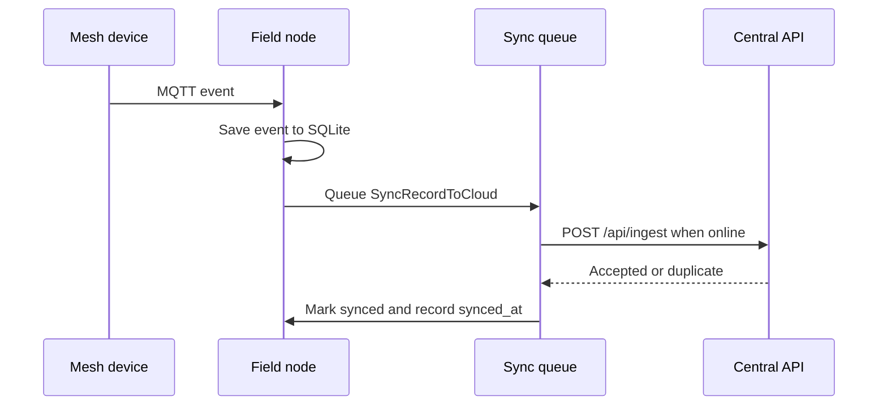

# MeshBeacon

<p align="center">
  
</p>

<p align="center">
  
</p>

<h3 align="center">Offline-first incident operations for mesh-connected response teams.</h3>

<p align="center">Receive telemetry, track incidents, send mesh commands, and keep working when the uplink disappears.</p>

<p align="center">
  <a href="https://github.com/MeshBeacon/meshbeacon/actions/workflows/tests.yml"></a>
  <a href="https://github.com/MeshBeacon/meshbeacon/actions/workflows/lint.yml"></a>
  <a href="https://github.com/MeshBeacon/meshbeacon/blob/main/LICENSE"></a>
  <a href="https://github.com/MeshBeacon/meshbeacon"></a>
</p>

<p align="center">
  <a href="#quick-install">Install</a> |
  <a href="#how-it-works">How it works</a> |
  <a href="#operator-workflows">Operator workflows</a> |
  <a href="#configuration">Configuration</a> |
  <a href="#licensing">License</a>
</p>

> MeshBeacon connects ClusterDuck or MamaDuck LoRa deployments to a Laravel operations console. It stores events locally, turns SOS messages into incidents, and forwards records to a central server when the network returns.

## Choose a deployment

| Deployment | Storage | Network model | Best for |
| --- | --- | --- | --- |
| Central server | MySQL or PostgreSQL | Always reachable | The main monitoring and ingestion site |
| Offline field node | SQLite | No upstream dependency | A response team working without Internet |
| Hybrid field node | SQLite plus a central API | Store locally, sync when online | Field teams that need local continuity and central reporting |

## Quick install

### Linux with Docker

If you want the default installation, you can just run the script as-is. The installer clones the project, creates `.env`, generates `APP_KEY`, creates the first administrator, builds the image locally, and starts the stack.

```sh
curl -fsSL https://raw.githubusercontent.com/MeshBeacon/meshbeacon/main/install.sh | sh
```

If you want to configure it beforehand, you can simply pass the environment variables inline with the install command. For example, if you already downloaded `install.sh`:

```sh
MESHBEACON_PORT=9000 MESHBEACON_ADMIN_EMAIL="admin@mydomain.com" ./install.sh
```

Or, when using the one-liner directly from the web:

```sh
curl -fsSL https://raw.githubusercontent.com/MeshBeacon/meshbeacon/main/install.sh | \
  MESHBEACON_INSTALL_DIR=/opt/meshbeacon \
  MESHBEACON_PORT=8080 \
  MESHBEACON_ADMIN_EMAIL=admin@example.com \
  sh
```

The default directory is `$HOME/meshbeacon`. The installer prints the generated password once. Set `MESHBEACON_UPDATE=1` when an existing checkout should pull the selected branch first.

### FreeBSD without Docker

```sh
curl -fsSL https://raw.githubusercontent.com/MeshBeacon/meshbeacon/main/install.sh | sudo sh
```

The FreeBSD path installs PHP, Composer, Node, Mosquitto, and the required PHP extensions with `pkg`. It starts the web server and workers with FreeBSD `daemon`. Put the PHP development server behind a production web server and process supervisor before exposing it to the Internet.

### First login

The installer uses `MESHBEACON_ADMIN_EMAIL` for the first account and prints the generated password. A fresh install has no shared default password. Open the printed URL, then change the password from account settings.

## How it works



The `mqtt-worker` subscribes to `hub/event` and dispatches `ProcessMqttMessage`. The job validates the payload, normalizes the mesh path, writes `cluster_data`, and queues follow-up work. Dashboard actions publish commands on `hub/command`.

### Hybrid store-and-forward



The field node keeps the local record when the central server is unavailable. Retries use the `sync` queue, and `(duck_id, message_id)` makes ingestion idempotent.

## Docker services

| Service | Role |
| --- | --- |
| `waf` | BunkerWeb ModSecurity WAF reverse proxy on the configured host port |
| `webserver` | Internal Nginx webserver |
| `app` | PHP-FPM Laravel application |
| `migrate` | Runs migrations and creates the first administrator |
| `permissions` | Sets volume ownership, then exits |
| `mqtt-server` | Mosquitto broker |
| `mqtt-worker` | Reads mesh events and dispatches jobs |
| `queue-worker` | Processes `sync` and `default` queues |
| `scheduler` | Runs scheduled commands every 60 seconds |

Compose uses named volumes for the SQLite database, Laravel storage, public assets, and Mosquitto data/logs. The image contains the source and dependencies, so Compose does not mount the checkout over the container.

## Pre-built Docker images

Instead of building the image locally, you can use the pre-built multi-architecture images from the GitHub Container Registry (GHCR).

To use the pre-built image with the automated installer, pass the `MESHBEACON_IMAGE_SOURCE=ghcr` environment variable:

```sh
MESHBEACON_IMAGE_SOURCE=ghcr ./install.sh
```

If you are setting up Docker Compose manually, set the image in your `.env` file before pulling and starting the stack:

```sh
echo "MESHBEACON_IMAGE=ghcr.io/9M2PJU/meshbeacon:latest" >> .env
docker compose pull
docker compose up -d
```

## Manual Docker setup

```sh
git clone https://github.com/MeshBeacon/meshbeacon.git
cd meshbeacon
cp .env.example .env
```

Set `APP_KEY`, `MESHBEACON_ADMIN_PASSWORD`, and the host ports in `.env`, then build and start the image:

```sh
docker buildx build \
  --load \
  --provenance=false \
  --file Dockerfile.compose \
  --tag meshbeacon:local \
  .
docker compose up -d --no-build
docker compose ps
```

Open `http://localhost:8080`, unless `MESHBEACON_PORT` or `APP_URL` has changed. Follow logs with `docker compose logs -f app mqtt-worker queue-worker`.

Update a deployment with:

```sh
git pull --ff-only
docker buildx build --load --provenance=false --file Dockerfile.compose --tag meshbeacon:local .
docker compose up -d --no-build
```

Back up the `app-database` and `app-storage` volumes before upgrades that contain incident data.

### Pulling vs. Building: What to configure?

The deployment method you choose determines which files you need to edit to customize MeshBeacon:

- **Using a pre-built image (`docker compose pull`)**: You are running the official, unmodified application code. The **only** file you need to edit is your `.env` file (to configure settings like `MESHBEACON_PORT`, database connections, or admin credentials). Any local changes you make to the PHP source code or `Dockerfile` will be ignored.
- **Building locally (`docker build ...`)**: You are compiling the application from the source directory. Use this approach if you are actively modifying the source code (such as editing PHP files in `app/`, modifying routes in `routes/`, or updating UI assets in `resources/`), altering `Dockerfile.compose`, or changing dependencies in `composer.json`. Because the source code is copied into the image during the build process, you must rebuild the image for your code changes to take effect. Environment variables are still managed at runtime via the `.env` file.

## Features

- MQTT ingestion from `hub/event` and commands on `hub/command`.
- Durable queues for events, commands, GPS polls, alerts, and hybrid synchronization.
- SOS acknowledgement, assignment, notes, status changes, resolution, and retransmission.
- GPS history, map links, device health, mesh topology, telemetry history, and reports.
- Optional Telegram SOS alerts and responder account linking.
- Read-only central dashboards for hybrid deployments.
- Linux `amd64` and `arm64` image builds through Docker Buildx.
- Native FreeBSD installation without a Linux container.

## Configuration

The full template lives in [.env.example](.env.example).

| Variable | Purpose | Example |
| --- | --- | --- |
| `APP_URL` | Public links and Telegram webhooks | `https://mesh.example.org` |
| `APP_KEY` | Laravel encryption key | `base64:...` |
| `APP_DEBUG` | Debug mode | `false` |
| `MESHBEACON_IMAGE` | Compose image | `meshbeacon:local` |
| `MESHBEACON_PORT` | Web host port | `8080` |
| `MESHBEACON_ADMIN_EMAIL` | First administrator email | `admin@example.com` |
| `MESHBEACON_ADMIN_PASSWORD` | First administrator password | A strong unique value |
| `DB_CONNECTION` | Database driver | `sqlite`, `mysql`, or `pgsql` |
| `DB_DATABASE` | SQLite path or database name | `/var/www/database/database.sqlite` |
| `QUEUE_CONNECTION` | Queue backend | `database` |
| `MQTT_HOST` / `MQTT_PORT` | Broker address | `mqtt-server` / `1883` |
| `MQTT_BIND_ADDRESS` / `MQTT_BIND_PORT` | Compose broker bind | `0.0.0.0` / `1883` |
| `MQTT_AUTH_USERNAME` / `MQTT_AUTH_PASSWORD` | Optional broker credentials | Empty by default |
| `MQTT_TLS_ENABLED` | Enable MQTT TLS | `false` |
| `CENTRAL_DMS_URL` | Central API base URL | `https://central.example.org` |
| `CENTRAL_DMS_TOKEN` | Shared hybrid-sync token | A long random token |
| `DASHBOARD_READONLY` | Reject central dashboard writes | `true` |
| `TELEGRAM_BOT_TOKEN` | Enable Telegram alerts | Empty by default |

For MySQL or PostgreSQL, set `DB_HOST`, `DB_PORT`, `DB_DATABASE`, `DB_USERNAME`, and `DB_PASSWORD` in addition to `DB_CONNECTION`.

## MQTT message shape

```json
{
  "MessageID": "unique-message-id",
  "eventType": "status",
  "payload": {
    "DeviceID": "duck-01",
    "Message": "MSG,TEXT:Ready",
    "path": ["duck-01", "gateway-01"],
    "origin": "duck-01",
    "destination": "gateway-01",
    "hops": 1,
    "duckType": 1
  }
}
```

## Operator workflows

| Workflow | Available actions |
| --- | --- |
| Incident response | Acknowledge SOS, assign responders, add notes, change status, resolve, retransmit |
| Device operations | View health, request GPS, set polling intervals, inspect telemetry |
| Mesh communications | Send status messages and broadcasts |
| Reporting | Export incident and period data as CSV or print views |
| Responder management | Manage users, roles, passwords, and two-factor authentication |
| Alerting | Link Telegram responders and send SOS notifications |
| Central monitoring | Keep dashboards read-only while field nodes send data upstream |

## Telegram alerts

1. Create a bot with `@BotFather` and copy its token and username.
2. Set `TELEGRAM_BOT_TOKEN`, `TELEGRAM_BOT_USERNAME`, and `TELEGRAM_WEBHOOK_SECRET`.
3. Set `APP_URL` to a public HTTPS URL.
4. Register the webhook:

   ```sh
   docker compose exec app php artisan telegram:set-webhook
   ```

5. Each responder can generate a link token from profile settings and send it to the bot.

Leave `TELEGRAM_BOT_TOKEN` empty to disable Telegram processing.

## Security checklist

- The Docker Compose stack includes BunkerWeb WAF by default to protect against SQLi, XSS, and brute force attacks.
- Keep `APP_DEBUG=false` outside development.
- Protect `APP_KEY`, database credentials, MQTT credentials, and hybrid tokens.
- Change the first administrator password after the first login.
- Restrict Mosquitto to the gateway network, or replace the anonymous listener with authentication and TLS.
- Put the web interface behind HTTPS and a reverse proxy on public networks.
- Keep `.env`, `auth.json`, Composer credentials, database files, and native Mosquitto data out of Git.
- Review the Livewire Flux license before redistributing an image that includes it.

## Web Application Firewall (WAF)

MeshBeacon deployments utilize a **Defense in Depth** approach. The `docker-compose.yml` is configured out-of-the-box with [BunkerWeb](https://www.bunkerweb.io/), an enterprise-grade Nginx WAF. 

- **WAF Layer (`waf`)**: Takes over the public port (e.g., `8080`) and reverse-proxies clean traffic to the webserver.
- **Protection**: Utilizes the OWASP Core Rule Set to drop SQL Injection (SQLi), Cross-Site Scripting (XSS), zero-day vulnerability exploits, and brute force login attempts.
- **Internal Routing**: The primary Nginx container (`webserver`) and Laravel application (`app`) are kept safely behind the Docker internal network to prevent bypasses and false-positives.

## Development

Requirements: PHP 8.2+, Composer, Node.js 22, npm, SQLite, and an MQTT broker.

```sh
composer install
cp .env.example .env
php artisan key:generate
touch database/database.sqlite
php artisan migrate --seed
npm ci
npm run build
```

Set `MESHBEACON_ADMIN_PASSWORD` in `.env` before `php artisan migrate --seed`.

Start the development processes in separate terminals:

```sh
composer run dev
php artisan app:mqtt-subscribe
php artisan queue:work --queue=sync,default --tries=5 --timeout=0
php artisan schedule:work
```

Run the checks with:

```sh
composer run test
php artisan test --filter=HybridSyncTest
php artisan test --filter=DashboardReadonlyTest
```

## Project map

| Path | Purpose |
| --- | --- |
| `app/Console` | MQTT, GPS, Telegram, and Artisan commands |
| `app/Jobs` | Event processing, alerts, commands, and sync jobs |
| `app/Http` | Controllers, API ingestion, and security middleware |
| `app/Livewire` | Dashboard, settings, authentication, and user workflows |
| `app/Models` | Telemetry, incidents, users, and GPS models |
| `database/migrations` | Schema and indexes |
| `resources/views` and `resources/js` | UI templates and frontend assets |
| `services/mosquitto` | Broker configuration and native-install directories |
| `services/nginx` | Nginx configuration |
| `Dockerfile.compose` | Multi-stage production image |
| `docker-compose.yml` | Web, workers, scheduler, migration, and broker |
| `install.sh` | Linux Docker and native FreeBSD installer |
| `docs/HYBRID_DEPLOYMENT.md` | Store-and-forward deployment notes |

## Container builds

Build a local image for the current host:

```sh
docker buildx build \
  --load \
  --provenance=false \
  --file Dockerfile.compose \
  --tag meshbeacon:local \
  .
```

Build an OCI artifact for Linux `amd64` and `arm64`:

```sh
docker buildx build \
  --platform linux/amd64,linux/arm64 \
  --file Dockerfile.compose \
  --tag meshbeacon:latest \
  --output type=oci,dest=meshbeacon.oci \
  .
```

FreeBSD uses the native installer. The Docker image contains a Linux userland and needs a Linux kernel.

The Dockerfile accepts an optional BuildKit secret named `composer_auth` for authenticated Composer installs. Keep Composer credentials out of image layers and the repository.

## Licensing

MeshBeacon first-party source and documentation use the Apache License 2.0. See [LICENSE](LICENSE).

The application includes third-party packages. Each dependency keeps its own license and attribution terms. The locked `livewire/flux` package declares a proprietary license, so redistribution requires the appropriate Flux license and Composer access. Review `composer.lock` and upstream terms before distributing a build.

The Apache License applies to MeshBeacon first-party work. It does not relicense third-party dependencies, trademarks, or service names.

## Contributing

Open an issue for a reproducible bug or focused feature request. Keep pull requests small enough to review, include tests for behavior changes, and update the relevant deployment or operator documentation.
