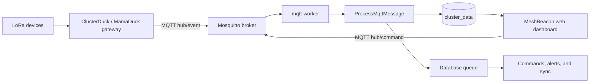
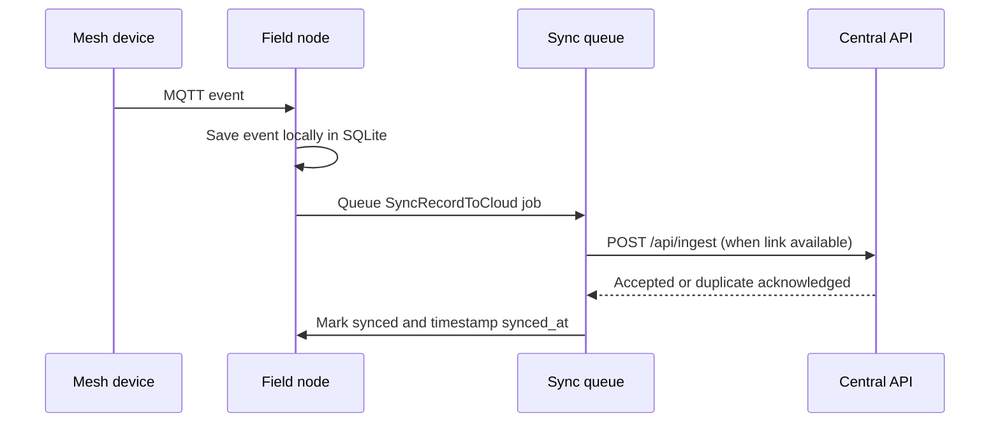

# MeshBeacon Ops

<p align="center">
  
</p>

<p align="center">
  
</p>

<h3 align="center">Offline-first incident operations for mesh-connected response teams.</h3>

<p align="center">Receive telemetry, track incidents, send mesh commands, display EOC kiosk wallboards, and keep working when the uplink disappears.</p>

<p align="center">
  <a href="https://github.com/MeshBeacon/meshbeacon/actions/workflows/tests.yml"></a>
  <a href="https://github.com/MeshBeacon/meshbeacon/actions/workflows/lint.yml"></a>
  <a href="https://github.com/MeshBeacon/meshbeacon/blob/main/LICENSE"></a>
  <a href="https://github.com/MeshBeacon/meshbeacon"></a>
</p>

<p align="center">
  <a href="#choose-a-deployment">Deployments</a> |
  <a href="#quick-install">Install</a> |
  <a href="#how-it-works">How it works</a> |
  <a href="#features">Features</a> |
  <a href="#operator-workflows">Workflows</a> |
  <a href="#offline-maps">Offline Maps</a> |
  <a href="#tak-cot-bridge">TAK Bridge</a> |
  <a href="#configuration">Configuration</a> |
  <a href="#licensing">License</a> |
  <a href="#contributing">Contributors</a>
</p>

> MeshBeacon connects ClusterDuck Protocol (MamaDuck, PapaDuck) LoRa deployments to a high-performance Laravel operations console. It stores events locally, turns SOS alerts into actionable incidents, renders tactical maps offline, and synchronizes upstream to central servers when connectivity is restored.

---

## Choose a deployment

| Deployment | Storage | Network model | Best for |
| --- | --- | --- | --- |
| **Central server** | MySQL or PostgreSQL | Always reachable | Main regional headquarters, central ingestion, and multi-agency coordination |
| **Offline field node** | SQLite | 100% offline / local mesh | Tactical response teams, mobile command posts, and disaster zones with zero internet |
| **Hybrid field node** | SQLite + Central API sync | Store locally, sync when online | Field units requiring immediate offline continuity with automatic upstream reporting |

---

## Quick install

### Linux with Docker

The automated installer configures your environment, creates `.env`, generates `APP_KEY`, creates the initial administrator, pulls the pre-built multi-arch Docker image from GHCR, and launches the entire stack.

```sh
curl -fsSL https://raw.githubusercontent.com/MeshBeacon/meshbeacon/main/install.sh | sh
```

To supply configuration inline:

```sh
curl -fsSL https://raw.githubusercontent.com/MeshBeacon/meshbeacon/main/install.sh | \
  MESHBEACON_INSTALL_DIR=/opt/meshbeacon \
  MESHBEACON_PORT=8080 \
  MESHBEACON_ADMIN_EMAIL=admin@example.com \
  sh
```

The default installation path is `$HOME/meshbeacon`. The installer generates and prints a secure administrator password upon initial run. To update an existing deployment, set `MESHBEACON_UPDATE=1`.

### FreeBSD without Docker

```sh
curl -fsSL https://raw.githubusercontent.com/MeshBeacon/meshbeacon/main/install.sh | sudo sh
```

The FreeBSD path installs PHP, Composer, Node, Mosquitto, and necessary extensions natively using `pkg`, managing processes via FreeBSD `daemon`. Place the service behind a production reverse proxy for public network exposure.

### First login

The installer provisions the initial account using `MESHBEACON_ADMIN_EMAIL` and prints the generated password. Open the URL shown in your terminal, sign in, and configure your profile from **Account Settings**.

---

## How it works



The `mqtt-worker` subscribes to `hub/event` and dispatches `ProcessMqttMessage`. Payloads are validated, mesh paths normalized, and written to `cluster_data`. Incidents and alerts trigger follow-up jobs, and dashboard operators publish command packets back through `hub/command`.

### Hybrid store-and-forward



Field nodes preserve all incident and telemetry data locally. When upstream connectivity resumes, background queue workers dispatch idempotent synchronization requests to the central cluster.

---

### Tuning healthcheck cadence for constrained field hardware

Each `app`, `mqtt-worker`, `queue-worker`, and `scheduler` healthcheck runs `php artisan observability:check`, which boots a short-lived PHP CLI process on every poll. The defaults (`MESHBEACON_HC_INTERVAL=10s`, `MESHBEACON_WORKER_HC_INTERVAL=15s`) suit an always-on server, but on constrained field hardware (a Raspberry Pi, for example) polling that often across several containers adds up in CPU and memory churn for little practical benefit. Set both variables in `.env` to a larger interval, such as `30s`-`60s`, to reduce that overhead - the underlying heartbeat TTLs (`OBSERVABILITY_MQTT_HEARTBEAT_TTL` 90s, `OBSERVABILITY_WORKER_HEARTBEAT_TTL` 45s, by default) already tolerate slower detection than the default poll cadence provides.

## Pre-built Docker images

Instead of building the image locally, you can use the pre-built multi-architecture images from the GitHub Container Registry (GHCR).

- **Offline-First Telemetry Ingestion**: Ingests real-time binary and text packets across LoRa mesh networks via MQTT (`hub/event` and `hub/command`).
- **Tactical Incident Management**: SOS auto-triage, responder assignment, triage notes, lifecycle status tracking, and mesh retransmissions.
- **High-Performance Offline MBTiles Map Engine**: Upload regional raster `.mbtiles` maps directly via UI (up to 500MB). Features sub-millisecond tile delivery via a lightweight PHP bypass (`public/tiles.php`), smart `maxNativeZoom` upscaling, and a global offline/online base layer toggle.
- **EOC Kiosk Wallboard (`/kiosk`)**: Fullscreen, auto-updating emergency operations center display designed for command post status monitors and TV arrays.
- **Dashboard Trends**: Battery and RSSI history charts built into `/dashboard`, filterable by duck and time range (24h / 7d / 30d).
- **Bilingual Interface**: Native multi-language support (English & Bahasa Melayu `ms`) with instant switching and user preference persistence.
- **TAK (Team Awareness Kit) Integration**: Live Cursor-on-Target (CoT) broadcast bridge for ATAK, iTAK, WinTAK, and OpenTAKServer with dedicated live audit logs (`/tak/logs`).
- **Automated Telegram Dispatch**: Instant SOS dispatch to Telegram responder channels with one-click responder account linking and live webhook logs (`/telegram/logs`).
- **System Health & Observability**: Production-grade liveness/readiness probes (`/health/live`, `/health/ready`), Prometheus metric endpoints (`/metrics`), and an interactive System Health dashboard (`/system-health`).
- **Comprehensive Reporting**: Export period-based and incident-specific audit reports in CSV and print-optimized PDF formats.
- **Security & Access Control**: Two-Factor Authentication (2FA via Fortify), Role-Based Access Control (`admin`, `responder`, `viewer`), and read-only instance locks.

---

## Operator workflows

| Workflow | Key Capabilities & Actions |
| --- | --- |
| **Incident Response** | Acknowledge SOS signals, assign field responders, add timestamped operational notes, change status, resolve, and retransmit mesh packets. |
| **Tactical & EOC Kiosk** | Launch fullscreen `/kiosk` wallboard for command post monitoring with live maps, alert feeds, and responder queues. |
| **Spatial & Offline Maps** | Upload `.mbtiles` packages in Settings, toggle between OpenStreetMap and offline raster layers, and track device GPS history. |
| **Analytics & Telemetry** | Inspect battery and signal-strength trends per duck, filterable by time range, from the Dashboard's Trends section. |
| **Mesh Operations** | View device health metrics, dispatch remote GPS polls, adjust polling intervals, and broadcast text messages across the mesh. |
| **Reporting & Export** | Generate CSV archives and print-ready incident dossiers for after-action reviews (AAR) and agency compliance. |
| **Log Auditing** | Live monitoring of TAK CoT multicasts (`/tak/logs`) and Telegram alert dispatches (`/telegram/logs`). |
| **Responder Administration**| Manage users, configure roles (Admin/Responder/Viewer), enforce 2FA, and link Telegram alert accounts. |

---

## Offline maps

MeshBeacon enables zero-connectivity mapping using standard raster MBTiles:

1. **Generate MBTiles**: Create regional raster map tiles using QGIS, TileMill, or MOBAC (see [docs/OFFLINE_MAPS.md](docs/OFFLINE_MAPS.md)).
2. **Upload**: Navigate to **Settings > Offline Map** in the MeshBeacon web dashboard and upload your `.mbtiles` file (supports uploads up to 500MB).
3. **Seamless Rendering**: The system automatically serves tiles via the high-speed `/tiles/{z}/{x}/{y}.png` endpoint.
4. **Smart Zoom**: If operators zoom beyond the pre-rendered zoom level of the MBTiles file, MeshBeacon natively upscales existing tiles to avoid gray placeholder tiles.

---

## TAK CoT bridge

MeshBeacon integrates directly with tactical situational awareness software (ATAK, iTAK, WinTAK, OpenTAKServer) via Cursor-on-Target (CoT):

1. **Ingest**: GPS coordinates and emergency beacons received from mesh nodes (PapaDuck/MamaDuck) are captured over MQTT.
2. **Translate**: The standalone bridge converts node telemetry into standard CoT XML payloads.
3. **Broadcast**: Payloads are transmitted via TAK Multicast (`239.2.3.1:4242`) or direct UDP to OpenTAKServer.
4. **Live Logs**: Monitor outgoing CoT transmissions directly from the **TAK Logs** dashboard (`/tak/logs`).

Read the setup guide in [docs/TAK_BRIDGE.md](docs/TAK_BRIDGE.md).

---

## Docker services

| Service | Role |
| --- | --- |
| `webserver` | Nginx web server handling HTTP requests and static asset routing |
| `app` | PHP-FPM Laravel 12 application core |
| `migrate` | Executes database migrations and provisions the initial admin account |
| `permissions` | Fixes storage and database file permissions on startup |
| `mqtt-server` | Eclipse Mosquitto MQTT broker |
| `mqtt-worker` | Subscribes to `hub/event` and dispatches processing jobs |
| `queue-worker` | Handles `sync` and `default` job queues |
| `scheduler` | Executes scheduled maintenance, GPS polling, and health checks |

---

## Configuration

- [Hybrid Store-and-Forward Deployment](docs/HYBRID_DEPLOYMENT.md)
- [OpenTAKServer Encrypted Bridge](docs/OPENTAK_BRIDGE.md)
- [OpenTAKServer & TAK Bridge Integration](docs/TAK_BRIDGE.md)
- [Offline Maps & QGIS Guide](docs/OFFLINE_MAPS.md)

Key settings from [.env.example](.env.example):

| Variable | Purpose | Example |
| --- | --- | --- |
| `APP_URL` | Public base URL and Telegram webhook origin | `https://mesh.example.org` |
| `APP_KEY` | Laravel application encryption key | `base64:...` |
| `APP_DEBUG` | Enable debug mode (disable in production) | `false` |
| `MESHBEACON_IMAGE` | Docker container image repository | `ghcr.io/9m2pju/meshbeacon:latest` |
| `MESHBEACON_PORT` | Exposed HTTP port | `8080` |
| `MESHBEACON_ADMIN_EMAIL` | Initial administrator email | `admin@example.com` |
| `MESHBEACON_ADMIN_PASSWORD` | Initial administrator password | Strong random string |
| `DB_CONNECTION` | Database engine (`sqlite`, `mysql`, or `pgsql`) | `sqlite` |
| `DB_DATABASE` | SQLite path or remote database name | `/var/www/database/database.sqlite` |
| `QUEUE_CONNECTION` | Queue driver | `database` |
| `MQTT_HOST` / `MQTT_PORT` | Mosquitto broker host and port | `mqtt-server` / `1883` |
| `MQTT_AUTH_USERNAME` / `MQTT_AUTH_PASSWORD` | Optional broker credentials | Empty by default |
| `CENTRAL_DMS_URL` | Central aggregation server URL | `https://central.example.org` |
| `CENTRAL_DMS_TOKEN` | Shared hybrid synchronization token | Random 64-char token |
| `DASHBOARD_READONLY` | Lock UI to read-only on central aggregators | `false` |
| `TELEGRAM_BOT_TOKEN` | Telegram Bot API token | `123456:ABC-DEF...` |
| `TELEGRAM_BOT_USERNAME` | Telegram Bot username | `MeshBeaconAlertBot` |
| `TELEGRAM_WEBHOOK_SECRET` | Secret token validating incoming webhooks | Random 32-char hex |
| `MAP_OFFLINE_ENABLED` | Toggle offline MBTiles map engine | `true` |

---

## MQTT message shape

```json
{
  "MessageID": "unique-message-id",
  "eventType": "status",
  "payload": {
    "DeviceID": "duck-01",
    "Message": "MSG,TEXT:Ready",
    "path": ["duck-01", "gateway-01"],
    "origin": "duck-01",
    "destination": "gateway-01",
    "hops": 1,
    "duckType": 1
  }
}
```

---

## Telegram alerts

1. Create a bot with [@BotFather](https://t.me/BotFather) and obtain the API token.
2. Set `TELEGRAM_BOT_TOKEN`, `TELEGRAM_BOT_USERNAME`, and `TELEGRAM_WEBHOOK_SECRET` in `.env`.
3. Set `APP_URL` to your public HTTPS address.
4. Register the webhook:

   ```sh
   docker compose exec app php artisan telegram:set-webhook
   ```

5. Responders link their personal Telegram accounts by generating an authorization token in **Profile Settings** and sending it to the bot.

---

## Development

Requirements: PHP 8.2+, Composer, Node.js 22, npm, SQLite, and Mosquitto.

```sh
composer install
cp .env.example .env
php artisan key:generate
touch database/database.sqlite
php artisan migrate --seed
npm ci
npm run build
```

Set `MESHBEACON_ADMIN_PASSWORD` in `.env` before running `php artisan migrate --seed`.

Start local development processes:

```sh
composer run dev
php artisan app:mqtt-subscribe
php artisan queue:work --queue=sync,default --tries=5 --timeout=0
php artisan schedule:work
```

Run test suite and style linters:

```sh
composer run test
php artisan test --filter=HybridSyncTest
php artisan test --filter=DashboardReadonlyTest
```

---

## Project map

| Path | Description |
| --- | --- |
| `app/Console` | Artisan CLI commands (MQTT worker, GPS polling, health heartbeats) |
| `app/Jobs` | Background queue jobs (MQTT processing, hybrid sync, alerts) |
| `app/Http/Controllers` | Web, API, healthcheck, and tile server controllers |
| `app/Livewire` | Reactive Livewire Flux components and interactive log viewers |
| `app/Models` | Eloquent models (telemetry, incidents, GPS, rules, logs) |
| `database/migrations` | Relational database schema definitions |
| `lang/` | Bilingual translation catalogs (`en`, `ms`) |
| `resources/views` | Blade templates (Dashboard, Kiosk, Analytics, GPS, Status) |
| `routes/` | Web routes (`web.php`), hybrid sync (`api.php`), and settings (`settings.php`) |
| `services/mosquitto` | Mosquitto broker configuration and access control |
| `services/nginx` | Nginx web server configuration templates |
| `Dockerfile.compose` | Multi-stage production container definition |
| `docker-compose.yml` | Multi-container stack orchestration |
| `install.sh` | Automated Linux (Docker) and FreeBSD deployment installer |
| `docs/HYBRID_DEPLOYMENT.md` | Store-and-forward architecture and configuration |
| `docs/OFFLINE_MAPS.md` | Guide to creating and loading raster MBTiles |
| `docs/TAK_BRIDGE.md` | TAK Cursor-on-Target (CoT) integration guide |

---

## Security checklist

- Maintain `APP_DEBUG=false` on all production and field nodes.
- Protect `APP_KEY`, database secrets, MQTT credentials, and hybrid sync tokens.
- Update the default administrator password immediately after installation.
- Restrict Mosquitto network listeners or enable TLS and authentication on exposed networks.
- Enforce HTTPS and secure reverse proxy termination on public endpoints.
- Keep `.env`, `auth.json`, and database binaries out of revision control.

---

## Licensing

MeshBeacon first-party code and documentation are released under the [Apache License 2.0](LICENSE).

Third-party dependencies retain their respective licenses. Livewire Flux Pro components included in compiled assets require appropriate licensing for redistribution.

---

## Contributing

Pull requests and issues are welcome! Please open an issue to discuss proposed features or bug fixes. Follow existing code conventions, keep PRs focused, include relevant tests, and branch from `Staging`.

### Contributors

<!-- readme: contributors -start -->
<table>
	<tbody>
		<tr>
            <td align="center">
                <a href="https://github.com/muhammadn">
                    
                    <br />
                    <sub><b>Muhammad Nuzaihan Bin Kamal Luddin</b></sub>
                </a>
            </td>
            <td align="center">
                <a href="https://github.com/9M2PJU">
                    
                    <br />
                    <sub><b>9M2PJU</b></sub>
                </a>
            </td>
		</tr>
	<tbody>
</table>
<!-- readme: contributors -end -->

