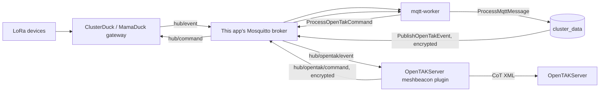

# MeshBeacon to OpenTAKServer Encrypted Bridge

Unlike the [TAK CoT Bridge](TAK_BRIDGE.md) (a separate, unencrypted standalone service that broadcasts plain CoT XML over UDP multicast), the OpenTAKServer bridge is a **plugin that runs inside OpenTAKServer itself** and exchanges data with this MeshBeacon instance over MQTT using end-to-end encryption, authenticated with a static X25519 keypair on each side.

> **Don't also enable the [TAK CoT Bridge](TAK_BRIDGE.md) against the same OpenTAKServer instance.** The two bridges use different `uid` conventions for the same Duck (`meshbeacon-<duck_id>` here vs. raw `DeviceID` there), so running both would produce two separate, unsynchronized markers per device in OTS — the plaintext one with none of this bridge's SOS/GeoChat/command features. Use the standalone TAK bridge only for targets that aren't running this plugin (plain ATAK/iTAK/WinTAK, or an OTS instance without it installed).

## How it works



1. `mqtt-worker` (the same worker that already runs `app:mqtt-subscribe`) processes each Duck telemetry event as usual, and — if the bridge is enabled and configured — dispatches `PublishOpenTakEvent`.
2. That job builds a JSON summary (duck ID, lat/lon if present, message text, altitude/speed/heading/battery/RSSI/SNR when the payload carries them, a `sos` flag, a `chat` flag, and timestamp), encrypts it with `OpenTakCryptoService`, and publishes it to `services.opentak.event_topic` (default `hub/opentak/event`) on this app's own Mosquitto broker. When an operator marks an incident resolved in the dashboard, `PublishOpenTakSosCancel` separately publishes a minimal `sos_cancel` event so OTS closes out the matching Alert. See the OTS plugin's own README for the exact field-by-field CoT mapping (telemetry attributes, `<emergency>` alert/cancel, and GeoChat for genuine field-device messages).
3. The OpenTAKServer plugin is an MQTT client connected to that same broker (the same way the standalone TAK bridge connects — see [TAK_BRIDGE.md](TAK_BRIDGE.md)'s "Connecting the bridge to this MeshBeacon instance" for the networking options). It decrypts the event and injects it into OpenTAKServer as a CoT point (plus a separate GeoChat CoT for `chat` events).
4. Commands issued from OpenTAKServer (e.g. an operator sending a mesh message back to a Duck) are encrypted by the plugin and published to `services.opentak.command_topic` (default `hub/opentak/command`). `mqtt-worker` decrypts them via `ProcessOpenTakCommand` and relays them to the Duck through the existing `MqttService::sendEncryptedCommand()` path.

## Encryption

Both directions use the same construction as `DuckCryptoService` (X25519 ECDH → HKDF-SHA256 → ChaCha20-Poly1305 IETF AEAD), but with a **separate keypair** dedicated to this bridge (`OpenTakCryptoService`) and a distinct HKDF info string, so this channel's keys are cryptographically independent of the Duck↔OpenDMS channel. Each side's ciphertext is bound (via AAD) to a fixed direction + message-type tag, so a captured event ciphertext can never be replayed back as a command or vice versa.

This is a fixed 1:1 peer relationship: generate one keypair per side, then paste each side's **public** key into the other's configuration. Private keys never leave the server that generated them.

## Setup

1. On this MeshBeacon instance, generate a keypair:

   ```sh
   php artisan opentak:keygen
   ```

   Paste the printed `OPENTAK_BRIDGE_PRIVATE_KEY` / `OPENTAK_BRIDGE_PUBLIC_KEY` into `.env`.

2. Install and configure the `opentakserver-meshbeacon-plugin` on the OpenTAKServer side (see that plugin's own README for its keygen step). Copy its printed public key into this app's `.env` as `OPENTAK_SERVER_PUBLIC_KEY`, and give it this app's `OPENTAK_BRIDGE_PUBLIC_KEY` in return.

3. Point the plugin's MQTT client at this app's Mosquitto broker, same as the standalone TAK bridge (see [TAK_BRIDGE.md](TAK_BRIDGE.md#connecting-the-bridge-to-this-meshbeacon-instance)).

4. Set `OPENTAK_BRIDGE_ENABLED=true` in this app's `.env` and restart the `app`, `mqtt-worker`, and `queue-worker` services.

5. Enable the plugin from the OpenTAKServer web UI's plugin manager.

Leave `OPENTAK_BRIDGE_ENABLED=false` (the default) or either public key unset to keep the bridge fully inert — `PublishOpenTakEvent` is never dispatched and `hub/opentak/command` is never subscribed to.

## Configuration reference

| `.env` variable | Purpose |
| --- | --- |
| `OPENTAK_BRIDGE_ENABLED` | Master switch for the bridge. Default `false`. |
| `OPENTAK_BRIDGE_PRIVATE_KEY` | This app's static X25519 private key, base64. Generated by `php artisan opentak:keygen`. Never share this. |
| `OPENTAK_BRIDGE_PUBLIC_KEY` | This app's static X25519 public key, hex (64 chars). Share this with the OTS plugin operator. |
| `OPENTAK_SERVER_PUBLIC_KEY` | The OpenTAKServer plugin's static public key, hex (64 chars). |
| `OPENTAK_EVENT_TOPIC` | MQTT topic this app publishes encrypted telemetry to. Default `hub/opentak/event`. |
| `OPENTAK_COMMAND_TOPIC` | MQTT topic this app subscribes to for encrypted commands. Default `hub/opentak/command`. |
